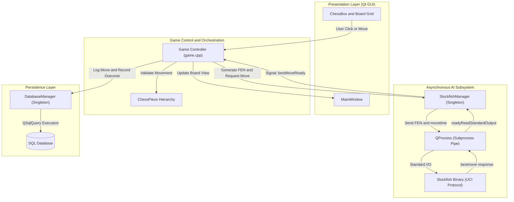

<div align="center">


# ♟️ Qt Chess Game with Stockfish AI Engine

### Cross-Platform Desktop Chess Application with Asynchronous AI Opponent & SQL Match Tracking

[](https://isocpp.org/)
[](https://www.qt.io/)
[](https://stockfishchess.org/)
[](https://sqlite.org/)
[](LICENSE)

<br/>

</div>

---

## 📖 Table of Contents
- [Project Overview](#-project-overview)
- [Key Features](#-key-features)
- [System Architecture](#-system-architecture)
- [Technical Highlights & Design Patterns](#-technical-highlights--design-patterns)
- [Repository Structure](#-repository-structure)
- [Getting Started & Build Instructions](#-getting-started--build-instructions)
- [Author & Contributions](#-author--contributions)
- [License](#-license)

---

## 📌 Project Overview

**Qt Chess Game** is a full-featured desktop chess application developed in modern **C++** using the **Qt Framework**. Beyond standard two-player local play, the application integrates the world-class **Stockfish Chess Engine** via the **Universal Chess Interface (UCI)** protocol to provide an intelligent, dynamic single-player experience with adjustable difficulty. 

The project also features a persistent **SQL Database** layer to track player profiles, log individual moves, and compile comprehensive match history and win/loss statistics.

---

## ✨ Key Features

| Feature | Description |
| :--- | :--- |
| ♟️ **FIDE Rule Compliance** | Full implementation of official chess rules: regular piece movement, castling (kingside & queenside), pawn promotion, en passant, check, and checkmate detection. |
| 🤖 **Stockfish AI Integration** | Intelligent computer opponent powered by Stockfish. Supports real-time FEN string board serialization and dynamic best-move calculation. |
| 🎚️ **Adjustable Difficulty** | Configurable AI skill level (0 to 20) adjusting thinking depth and search parameters via UCI commands. |
| 💾 **SQL Match Persistence** | Integrated SQL database tracking game sessions, player statistics (Wins, Losses, Draws), and historical move notation. |
| 🔊 **Dynamic Audio & Visuals** | Dedicated sound effects (`SFX`) for moves, captures, checks, castling, and checkmate, paired with high-resolution piece graphics. |
| ⚡ **Responsive UI (60 FPS)** | Non-blocking architecture ensuring the user interface remains completely smooth even during intensive AI tree evaluations. |

---

## 🔬 System Architecture

The application adopts an event-driven architecture separating the presentation layer (Qt GUI), game orchestration logic, external AI engine communication, and database storage:



---

## 🛠️ Technical Highlights & Design Patterns

### 1. Singleton Design Pattern
Critical shared resources are encapsulated using the thread-safe Meyer's Singleton pattern with deleted copy constructors and assignment operators:
* `StockfishManager::instance()`: Manages the lifecycle of the background Stockfish process.
* `DatabaseManager::instance()`: Maintains a singular database connection pool and manages transaction safety.

### 2. Non-Blocking Asynchronous IPC (Inter-Process Communication)
Rather than blocking the main GUI thread while the AI calculates moves, `StockfishManager` manages Stockfish as a detached worker process through `QProcess`:
```cpp
// Asynchronous calculation trigger
void StockfishManager::getBestMove(const QString &fen, int thinkTimeMs) {
    sendCommand("position fen " + fen);
    sendCommand("go movetime " + QString::number(thinkTimeMs));
}

// Signal emitted upon non-blocking stdout capture
connect(process, &QProcess::readyReadStandardOutput, this, &StockfishManager::onDataReceived);
```

### 3. FEN Board State Serialization
Board layouts are mapped directly into standard **Forsyth–Edwards Notation (FEN)** strings before being piped to the AI engine, ensuring compatibility with international chess standards and external analysis engines.

---

## 📁 Repository Structure

```
ChessGame/
├── ChessGame.pro                   # Qt qmake project configuration
├── main.cpp                        # Application entry point
├── mainwindow.cpp / .h / .ui       # Primary window, menu actions, and board canvas
├── game.cpp / .h                   # Master game loop, turn switching, check rules
├── chessbox.cpp / .h               # Individual board cell representation & events
├── chesspiece.cpp / .h             # Piece abstractions (King, Queen, Rook, etc.)
├── stockfishmanager.cpp / .h       # Asynchronous UCI manager for Stockfish
├── databasemanager.cpp / .h        # SQL queries, player profiles, and move logs
├── ChessGameDB_CreateTables.sql    # Schema definition for player & match tables
├── viewDB_chessgame.sql            # Utility queries for inspecting match statistics
├── images/                         # Chess piece sprites, board textures, and logo
├── SFX/                            # WAV sound effects (move, capture, castle, checkmate)
├── res.qrc                         # Qt resource bundle
├── LICENSE                         # MIT License
└── README.md                       # Technical documentation
```

---

## 🚀 Getting Started & Build Instructions

### Prerequisites
* **Qt 5.15+** or **Qt 6.x** installed with **MinGW 64-bit** or **MSVC**.
* **Qt Creator IDE**.
* **Stockfish Chess Engine**: Download the official binary for your platform from [Stockfish Official Website](https://stockfishchess.org/download/).

### Build Steps
1. **Clone the repository:**
   ```bash
   git clone https://github.com/linh-nguyen123/ChessGame.git
   cd ChessGame
   ```

2. **Place the Stockfish binary:**
   * Download the latest Stockfish executable.
   * Place the binary in the project build directory (or inside the designated `bin/` path recognized by `stockfishmanager.cpp`).

3. **Open and configure with Qt Creator:**
   * Launch Qt Creator and select **Open Project** -> Choose `ChessGame.pro`.
   * Select your desktop kit (e.g., `Desktop Qt 6.x.x MinGW 64-bit`).

4. **Build & Execute:**
   * Press `Ctrl + B` to build the application.
   * Press `Ctrl + R` to run the game.

---

## 👨‍💻 Author & Contributions
- **Author**: Nguyen Linh (Lucas)
- **GitHub**: [@linh-nguyen123](https://github.com/linh-nguyen123)
- **Contributions**: Feel free to fork, submit issues, or open pull requests to enhance the engine or GUI!

---

## 📄 License
This project is licensed under the **MIT License** - see the [LICENSE](LICENSE) file for details.
